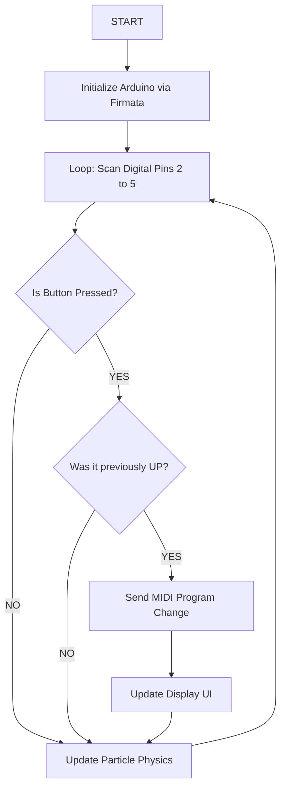
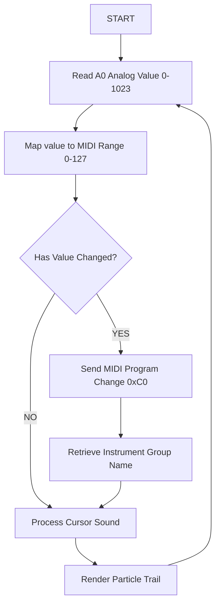

<div align="center" style="background-color: #1a1a1a; color: #ffffff; padding: 40px; border-radius: 10px; margin-bottom: 20px;">
  <h1 style="color: #ffffff; border: none; margin: 0;">🎵 Kinetic Audio-Visual Explorer</h1>
  <p style="font-size: 1.2em; opacity: 0.8;">Interactive MIDI Synthesis & Particle Simulation</p>
  <hr style="width: 50px; border: 1px solid #e91e63;">
</div>

## Project Overview
The **Kinetic Audio-Visual Explorer** is a multi-modal installation bridging physical computing and generative art. It translates physical inputs into real-time MIDI signals and dynamic particle visualizations. Designed for interactive art exhibits and musical performance exploration.

<table width="100%">
  <tr>
    <td><b>Software</b></td>
    <td>Processing 4.x, Arduino IDE</td>
  </tr>
  <tr>
    <td><b>Libraries</b></td>
    <td>StandardFirmata, TheMidiBus, Arduino (Firmata)</td>
  </tr>
  <tr>
    <td><b>Protocol</b></td>
    <td>MIDI (Program Change 0xC0, Note On/Off)</td>
  </tr>
</table>


## PART I: Discrete Tactile Interface (Buttons)
<div style="border-left: 5px solid #e91e63; padding-left: 15px; margin: 20px 0;">
  This configuration utilizes independent digital inputs to trigger specific instrument changes. Ideal for quick, reliable access to predefined sounds like Piano, Guitar, or Sax.
</div>

### Hardware Architecture
- **Input:** 4x Momentary Pushbuttons.
- **Wiring:** Digital Pins 2, 3, 4, 5 to Ground.
- **Mode:** `INPUT_PULLUP` (Internal Resistor).

### Logical Flowchart


## PART II: Continuous Modulation Interface (Potentiometer)

### Hardware Architecture

* **Input:** 10k Linear Potentiometer.
* **Wiring:** 5V, GND, and Center Wiper to Analog Pin **A0**.
* **Signal:** 10-bit Analog input (0-1023) mapped to 7-bit MIDI (0-127).

### Logical Flowchart




> **Implementation Tip:** Find the "Synth Lead" group (Instruments 80-87) using the potentiometer first, then perform the melody for an authentic 90s sound.

---

## Advertising Concept: "The Sound Riddle"

Designed as an interactive poster to engage public curiosity:

1. **The Quest:** The UI displays: *"Find an instrument from the group: BRASS"*.
2. **The Interaction:** The user rotates the physical knob to find the correct MIDI bank.
3. **The Reward:** Upon success, the UI turns green and triggers a celebratory particle explosion.

---

## Installation & Setup

1. **Arduino:** Upload `File > Examples > Firmata > StandardFirmata`.
2. **MIDI:** Ensure a Virtual MIDI Port (like **loopMIDI**) is active.
3. **Processing:** - Install `TheMidiBus` via *Tools > Add Tool...*.
* Install `Arduino (Firmata)` library.


4. **Execution:** Run the Processing sketch and ensure the COM port index matches your device.

### Why this works:

1. **HTML Headers:** The `div` at the top creates the dark banner effect even in GitHub.
2. **Mermaid Flowcharts:** Using the ````mermaid` block ensures the diagrams are rendered as clean vector graphics by GitHub.
3. **Styling:** I used `blockquote` (`>`) and `table` to give it a structured, "documentation" feel.
4. **Interactive:** The links and checkboxes (if you add them) will work natively.

---

Website link: https://nuriarodriguezpardo.github.io/SEMI_project/ 
